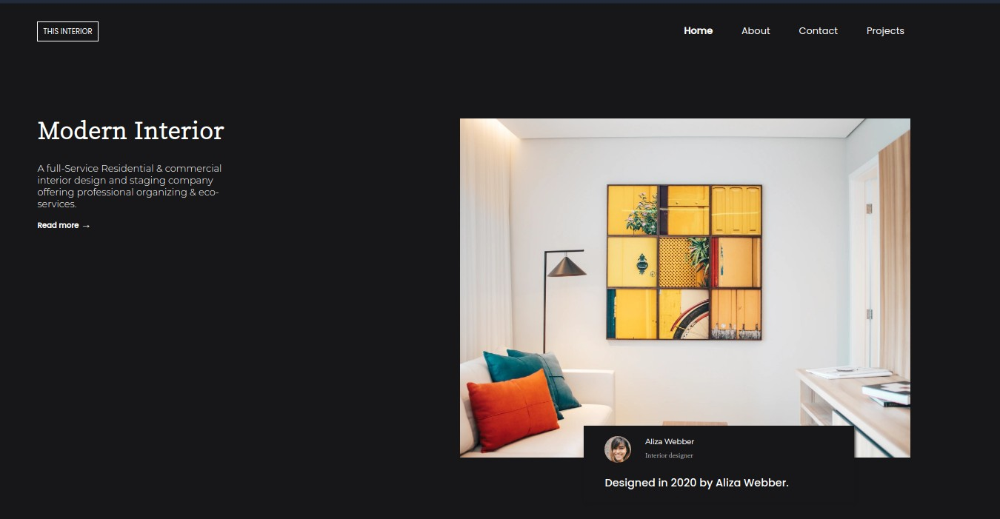

<!-- Please update value in the {}  -->

<h1 align="center">{Interior design challenge}</h1>

   Solution for a challenge from  <a href="http://devchallenges.io" target="_blank">Devchallenges.io</a>.

  <h3>
    <a href="https://interior-designn.netlify.app/">
      Demo
    </a>
     | 
    <a href="https://devchallenges.io/challenges/Jymh2b2FyebRTUljkNcb">
      Challenge
    </a>
  </h3>

<!-- TABLE OF CONTENTS -->

## Table of Contents

- [Overview](#overview)
  - [Built With](#built-with)
- [Features](#features)
- [Contact](#contact)
- [Acknowledgements](#acknowledgements)

<!-- OVERVIEW -->

## Overview

Introduce your projects by taking a screenshot or a gif. Try to tell visitors a story about your project by answering:

- You can check out the demo here:[Demo](http://interior-designn.netlify.app/)

- This was a very interesting project. I struggled for quite a bit before I got a lot of things to work and I'd say it contributed positively to the experience.

- I've learned to not easily give up and nothing is impossible if I put my mind to it.

- Wisdom - I know what it is to give up, now I wanna see what happens when I don;t.

### Built With

<!-- This section should list any major frameworks that you built your project using. Here are a few examples.-->

- [SCSS](https://sass-lang.com/)

## Features

<!-- List the features of your application or follow the template. Don't share the figma file here :) -->

This application/site was created as a submission to a [DevChallenges](https://devchallenges.io/challenges) challenge. The [challenge](https://devchallenges.io/challenges/Jymh2b2FyebRTUljkNcb) was to build an application to complete the given user stories.

## Acknowledgements

<!-- This section should list any articles or add-ons/plugins that helps you to complete the project. This is optional but it will help you in the future. For exmpale -->

- [Steps to replicate a design with only HTML and CSS](https://devchallenges-blogs.web.app/how-to-replicate-design/)
- [Marked - a markdown parser](https://github.com/chjj/marked)

## Contact

- GitHub [@adeleke5140](https://{github.com/adeleke5140})
- Twitter [@adeleke5140](https://{twitter.com/adeleke5140})
